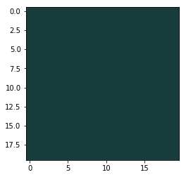
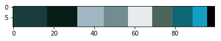

# Color-Extraction
Using KMeans Clustering Algorithm extracted the most dominant color in an image and generated a color palette based on the dominance of the colors in the image

## Sample Image

## Most Dominant Color

## Palette

